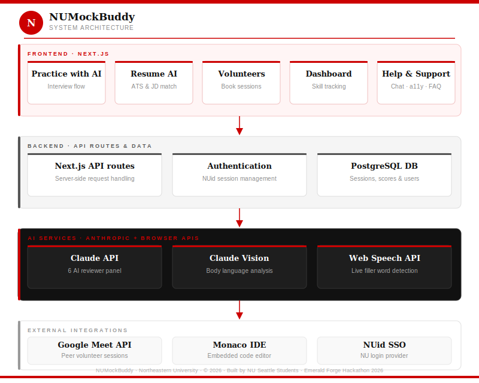

# NUMockBuddy

> **Ace your interviews with AI on your side.**
> AI-powered mock interview prep built exclusively for Northeastern University students & alumni.

[](https://numockbuddy.netlify.app/)


---

## 🔗 Live Demo

**[https://numockbuddy.netlify.app/](https://numockbuddy.netlify.app/)**

---

## What is NUMockBuddy?

NUMockBuddy gives Northeastern students realistic interview questions based on actual company patterns, instant feedback from 6 AI expert reviewers running in parallel, and direct access to NU students who've already landed their dream co-op.

Generic tools like LeetCode and Pramp don't know NU's co-op cycle, your specific program (MSCS, MSIS, DS), or which companies actually recruit here. NUMockBuddy does.

---

## 🚀 Live Demo
**https://numockbuddy.netlify.app/**

---

## Features

### 🎯 Practice with AI
- Questions generated from actual interview formats at **Google, Amazon, Meta, Microsoft, Apple, Fidelity, Salesforce, and Adobe**
- Tailored by role (SWE, DS, TPM, Audit) and job type (Internship/Co-op or Full-time)
- Covers Technical, Behavioral, System Design, and HR formats
- **Video Mode** — camera + mic enabled, Monaco IDE opens for coding questions
- **AssemblyAI** transcribes speech live and flags filler words in real time
- **Claude Vision** analyzes periodic camera snapshots for body language scoring
- After each session, **6 parallel `claude-sonnet-4-20250514` calls** act as independent expert reviewers, each scoring a different dimension simultaneously:
  - Communication · Technical Depth · Problem Solving · Behavioral Framing · Confidence · Overall
- Model answer provided for every question

### 🤝 Peer Volunteer Network
- Browse NU students who've completed co-ops at your target company
- Filter by company, role, or skill
- Request a session — Google Meet link auto-generated and **meeting invite sent to both the requester and the volunteer**
- Get referral tips, company-specific prep, and real co-op stories
- Sign up as a volunteer — set your availability on a calendar picker

### 📄 Resume Analysis
Three Claude API-powered routes:
- **JD vs Resume** (`/api/resume-ai/analyze`) — keyword gap analysis, ATS match score, AI-rewritten bullet points
- **ATS Scanner** (`/api/resume-ai/ats`) — readability score, formatting check, keyword density analysis
- **Career Assistant** (`/api/resume-ai/chat`) — full RAG pipeline (LangChain + OpenAI `text-embedding-3-small` + MemoryVectorStore + ChromaDB + Claude) for cover letters, outreach messages, LinkedIn summaries, and interview coaching. Supports attaching up to 3 files (PDF/DOCX parsed via `pdf-parse` and `mammoth`)

### 📊 Performance Dashboard
- Tracks scores across all 6 expert dimensions over time
- Skill trend graphs showing improvement session by session
- Daily question card auto-seeded from your weakest skill area
- Full session history with question-by-question AI feedback

### 💬 Help & Support
- Searchable Help Center — 9 articles across Getting Started, Mock Interviews, Resume AI, Peer Mentors, and Account Support
- **NUMockBuddy Assistant** chat widget on every page (powered by Claude API)
- Feedback system — Session Feedback, Platform Feedback, Peer Mentor Ratings, Bug Reports, Feature Requests
- Accessibility Menu — font size, dyslexia font, dark/light/high contrast, letter spacing, line height, reading guide, stop animations, big cursor

---

## Architecture



See [`architecture_neu.html`](./architecture_neu.html) for the interactive version with clickable components.

---

## Tech Stack

### Frontend
| Technology | Role |
|---|---|
| **Next.js 14** (App Router) | Full-stack React framework |
| **TypeScript** | Type-safe development |
| **Tailwind CSS** | Utility-first styling |

### Backend
| Technology | Role |
|---|---|
| **Next.js API Routes** | Serverless endpoints, same repo |
| **PostgreSQL** | Users, sessions, scores, volunteer availability |
| **bcryptjs** | Password hashing |
| **Custom JWT session** | Authentication & session management |

### AI & ML
| Technology | Model | Role |
|---|---|---|
| **Anthropic Claude API** | `claude-sonnet-4-20250514` | 6 parallel expert reviewers, resume analysis, career chatbot, question generation |
| **AssemblyAI API** | — | Live speech transcription + real-time filler word detection |
| **Claude Vision** | `claude-sonnet-4-20250514` | Body language analysis from camera snapshots |
| **OpenAI Embeddings** | `text-embedding-3-small` | RAG pipeline for Career Assistant |
| **LangChain** | — | RAG orchestration |
| **MemoryVectorStore + ChromaDB** | — | Vector storage for Career Assistant context |

### File Parsing
| Library | Role |
|---|---|
| **pdf-parse** | Extract text from uploaded PDF resumes |
| **mammoth** | Extract text from uploaded DOCX resumes |

### Integrations
| Integration | Role |
|---|---|
| **Monaco IDE** | Embedded VS Code-style editor for coding questions |
| **Google Meet API** | Auto-generates meeting link + sends calendar invite to both parties on session confirmation |

### Deployment
| Platform | URL |
|---|---|
| **Netlify** | [https://numockbuddy.netlify.app/](https://numockbuddy.netlify.app/) |

---

## API Routes

```
app/api/
├── practice/
│   └── score/route.ts        # 6 parallel claude-sonnet-4-20250514 calls — expert reviewer panel
├── resume-ai/
│   ├── analyze/route.ts      # JD vs Resume deep analysis + role rating
│   ├── ats/route.ts          # ATS compatibility scanner
│   └── chat/route.ts         # Career Assistant (RAG: LangChain + ChromaDB + Claude)
└── ...
```

---

## Getting Started

### Prerequisites

- Node.js 18+
- PostgreSQL
- Anthropic API key
- AssemblyAI API key
- OpenAI API key (for embeddings)

### Installation

```bash
git clone https://github.com/Richa-04/NUMockBuddy.git
cd NUMockBuddy
npm install
cp .env.example .env.local
```

Add to `.env.local`:
```env
ANTHROPIC_API_KEY=your_key_here
ASSEMBLYAI_API_KEY=your_key_here
OPENAI_API_KEY=your_key_here
DATABASE_URL=postgresql://...
NEXTAUTH_SECRET=your_secret_here
GOOGLE_CLIENT_ID=your_id_here
GOOGLE_CLIENT_SECRET=your_secret_here
```

```bash
npm run db:migrate
npm run dev
```

Open [http://localhost:3000](http://localhost:3000).

---

## Project Structure

```
NUMockBuddy/
├── app/
│   ├── api/
│   │   ├── practice/score/   # 6-expert AI reviewer panel
│   │   └── resume-ai/        # analyze / ats / chat (RAG)
│   ├── practice/             # Mock interview flow
│   ├── volunteers/           # Peer volunteer network
│   ├── resume-ai/            # Resume analysis tools
│   ├── dashboard/            # Performance dashboard
│   ├── help/                 # Help center
│   └── feedback/             # Feedback system
├── components/               # Shared React components
├── lib/                      # Utilities, API clients, RAG setup
├── public/                   # Static assets
├── architecture_neu.svg      # Architecture diagram (static)
└── architecture_neu.html     # Architecture diagram (interactive)
```

---

## Stats

| Metric | Value |
|---|---|
| Mock sessions done | 400+ |
| AI expert reviewers per session | 6 (parallel Claude calls) |
| Companies covered | 30+ |
| Average student rating | 4.8 ★ |
| NU students on platform | 2,400+ |
| Co-op placement rate | 94% |

---

## Built By

NUMockBuddy was built by **NU Seattle Students** at **Emerald Forge Hackathon 2026**.

---

## License

MIT © 2026 NUMockBuddy — Northeastern University
